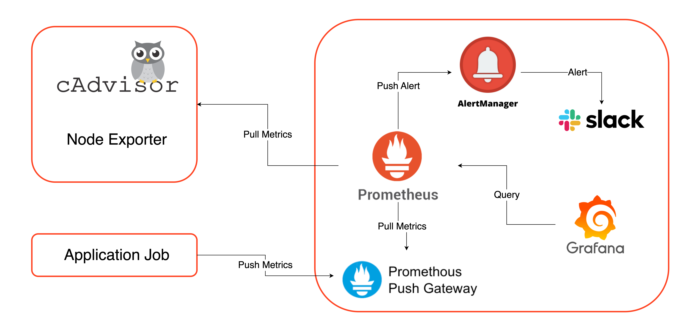

# Alloy 적용 전, Prometheus + Loki + Tempo + Otel Collector 구성입니다. (보존용)

# Monitoring Stack



## 개요

이 프로젝트는 Docker Compose를 사용하여 완전한 모니터링 스택을 구성합니다. 메트릭, 로그, 트레이스 데이터를 수집하고 시각화하는 통합 모니터링 솔루션을 제공합니다.

## 구성 요소

### 핵심 서비스
- **Prometheus**: 메트릭 수집 및 저장
- **Grafana**: 시각화 및 대시보드
- **Loki**: 로그 수집 및 저장
- **Tempo**: 분산 추적 (OpenTelemetry 호환)
- **OpenTelemetry Collector**: 데이터 수집 및 라우팅

### 추가 서비스
- **Alertmanager**: 알림 관리 및 슬랙 통합
- **Pushgateway**: 배치 작업 메트릭 수집
- **Node Exporter**: 시스템 메트릭 수집
- **cAdvisor**: 컨테이너 메트릭 수집
- **Blackbox Exporter**: HTTP/HTTPS 엔드포인트 모니터링
- **Nginx**: 리버스 프록시 및 통합 엔드포인트 제공
- **Cloudflared**: Cloudflare 터널 연결 (선택 사항)

## 서비스 접근

모든 서비스는 Nginx를 통해 접근할 수 있습니다:

- **Grafana**: http://localhost/
- **Prometheus**: http://localhost/prometheus/
- **Loki**: http://localhost/loki/
- **Tempo**: http://localhost/tempo/
- **Alertmanager**: http://localhost/alertmanager/
- **Pushgateway**: http://localhost/pushgateway/
- **OTel Collector**: http://localhost/otel-collector/

## 데이터 수집 엔드포인트

### OpenTelemetry Collector (권장)
OpenTelemetry Collector는 모든 텔레메트리 데이터(메트릭, 로그, 트레이스)를 단일 엔드포인트로 수집합니다:

- **OTLP gRPC**: http://localhost/otlp
- **OTLP HTTP 트레이스**: http://localhost/otlp/v1/traces
- **OTLP HTTP 메트릭**: http://localhost/otlp/v1/metrics
- **OTLP HTTP 로그**: http://localhost/otlp/v1/logs

### 직접 백엔드 연결 (대체 방법)
각 백엔드에 직접 연결할 수도 있습니다:

- **Tempo OTLP HTTP**: http://localhost/tempo/otlp/v1/traces
- **Tempo OTLP gRPC**: http://localhost/tempo/otlp/grpc/
- **Prometheus Remote Write**: http://localhost/prometheus/api/v1/write
- **Loki Push API**: http://localhost/loki/api/v1/push

## 분산 추적 (Tempo)

Tempo는 OpenTelemetry OTLP를 지원하는 분산 추적 백엔드입니다.

### 지원 프로토콜
- **OpenTelemetry OTLP** (HTTP/gRPC)

### 트레이스 테스트

Tempo 테스트를 위해 다음 스크립트를 실행할 수 있습니다:

```bash
cd task
python test_tempo.py
```

### Grafana에서 트레이스 확인

1. Grafana에 접속
2. Explore 메뉴로 이동
3. Tempo 데이터 소스 선택
4. 트레이스 ID로 검색 (예: `1234567890abcdef1234567890abcdef`)

## 알림 설정

Alertmanager는 Prometheus 알림 규칙에 따라 알림을 관리합니다:

- **Django 알림**: Django 애플리케이션의 CPU 사용량 모니터링
- **API 서버 알림**: 외부 API 서버의 가용성 모니터링

알림은 Slack으로 전송되며, 사용자 지정 템플릿을 통해 포맷됩니다.

## 에이전트 설정

호스트 시스템 및 컨테이너 메트릭을 수집하기 위한 에이전트:

- **Node Exporter**: 호스트 시스템 메트릭 수집 (포트 9100)
- **cAdvisor**: 컨테이너 메트릭 수집 (포트 8088)

## 시작하기

1. 환경 변수 설정:
```bash
export GRAFANA_ADMIN_USER=admin
export GRAFANA_ADMIN_PASSWORD=admin
export CLOUDFLARE_TUNNEL_TOKEN=your_token_here  # 선택 사항
export GRAFANA_DOMAIN=your-domain.com  # Grafana 도메인 (기본값: localhost)
```

2. 모니터링 스택 시작:
```bash
cd monitoring
docker-compose up -d
```

3. Agent 시작 (선택사항):
```bash
cd agent
docker-compose up -d
```

## 애플리케이션 연동

### OpenTelemetry SDK 설정 (권장)

애플리케이션에서 OpenTelemetry SDK를 사용하여 OTel Collector로 텔레메트리 데이터를 전송합니다:

```python
# Python 예시
from opentelemetry import trace
from opentelemetry.exporter.otlp.proto.grpc.trace_exporter import OTLPSpanExporter
from opentelemetry.sdk.resources import SERVICE_NAME, Resource
from opentelemetry.sdk.trace import TracerProvider
from opentelemetry.sdk.trace.export import BatchSpanProcessor

# OTel Collector 엔드포인트 설정
otlp_endpoint = "http://localhost/otlp"

# 리소스 및 트레이서 설정
resource = Resource(attributes={SERVICE_NAME: "my-service"})
tracer_provider = TracerProvider(resource=resource)
trace.set_tracer_provider(tracer_provider)

# OTLP 익스포터 설정
otlp_exporter = OTLPSpanExporter(endpoint=otlp_endpoint)
span_processor = BatchSpanProcessor(otlp_exporter)
tracer_provider.add_span_processor(span_processor)

# 트레이서 사용
tracer = trace.get_tracer(__name__)
with tracer.start_as_current_span("my-operation"):
    # 비즈니스 로직
    pass
```

## 데이터 흐름

1. **애플리케이션** → OpenTelemetry SDK
2. **OpenTelemetry SDK** → OTel Collector
3. **OTel Collector** → 각 백엔드 (Prometheus, Loki, Tempo)

4. **백엔드** → Grafana (시각화)
